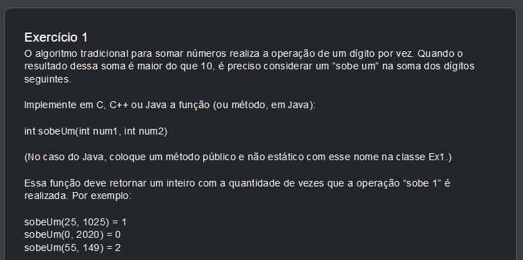

## Exercicios da prova para entrar no curso de capacitação da CTEDS (Grupo D)

Aqui estou guardando os très problemas práticos de programação feitos com C++ da prova para entrar no [curso de capacitação da CTEDS Poli-USP que ocorreu dia 08/06/2022 (4a feira)](https://www.poli.usp.br/noticias/destaque-home/68581-poli-usp-oferece-curso-de-capacitacao-tecnologica-em-engenharia-e-desenvolvimento-de-software.html).

### Exercício 1

